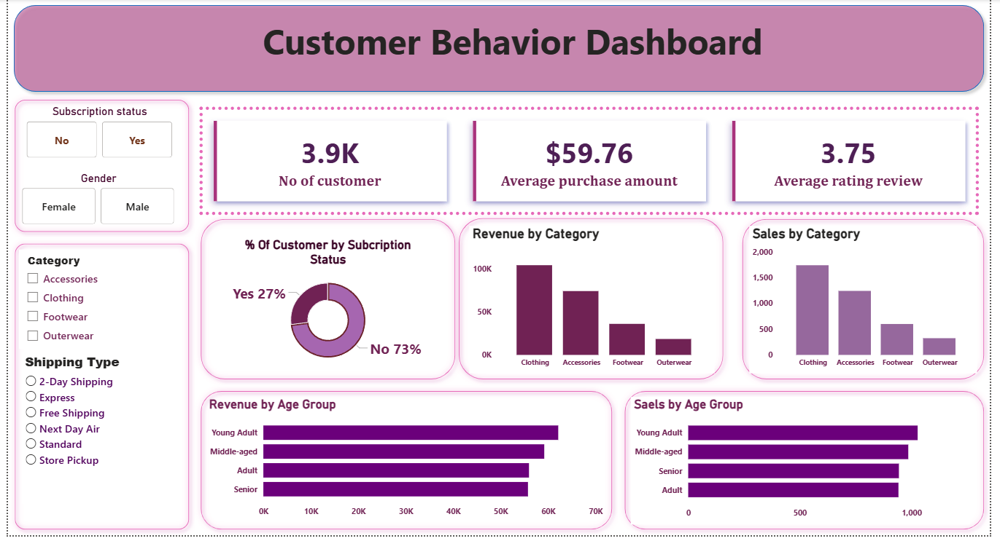

# Data-Driven Insights on Customer-Loyalty Revenue and Product-Trend
🛍️ Customer Shopping Behavior Analysis

An end-to-end data analytics project uncovering actionable insights from 3,900 customer purchases to support strategic business decisions.
This project covers the complete workflow — data cleaning, feature engineering, SQL analysis, and Power BI dashboarding.

📊 Project Overview
Metric	Value
Total Purchases	3,900
Columns Analyzed	18
Missing Values	37 (only in Review Rating)
Tech Stack	Python, Pandas, MySQL, Power BI

This project focuses on understanding customer demographics, revenue patterns, product trends, discounts, and loyalty behavior.

🧹 Data Preparation Workflow
1. Data Loading

Imported raw dataset using Pandas

Performed structure and summary review

2. Missing Values Handling

Missing Review Ratings were imputed using median rating per category

3. Feature Engineering

Created additional meaningful fields:

Age groups

Purchase frequency categories

Revenue segmentation

4. Database Integration

Loaded cleaned data into MySQL/PostgreSQL

Performed advanced SQL queries for insights

📈 Key Insights
🔹 Revenue by Gender

Female customers generate slightly higher revenue

Tailored gender-based marketing can improve conversions

🔹 High-Value Discount Users

Smart shoppers spend above average while consistently using discounts
➡️ Ideal for targeted premium discount campaigns

🔝 Top-Rated Products
Product	Rating
Blouse	⭐ 5
Dress	⭐ 5
Shirt	⭐ 4

These products can be pushed in marketing campaigns due to high satisfaction levels.

🚚 Impact of Shipping Preference
Shipping Type	Avg Spend
Express	$65
Standard	$58

Express users spend 12% more, making them a prime segment.

📩 Subscription Impact

Subscribers spend 68% more

Subscription customers contribute 45% of total revenue

78% retention rate among subscribers

👥 Customer Segmentation
1️⃣ Loyal Customers

~15%

Highest revenue contribution

2️⃣ Returning Customers

~35%

Regular shoppers with high potential to convert to loyal

3️⃣ New Customers

~50%

Biggest growth opportunity

🧠 Strategic Recommendations

✔ Boost Subscriptions

Promote exclusive member benefits.

✔ Strengthen Loyalty Programs

Reward frequent buyers to increase retention.

✔ Targeted Marketing Campaigns

Focus on:

Express shipping users

High-value discount users

Top-rated products

✔ Product Positioning

Highlight high-rated items in product pages and ads.

🛠️ Tech Stack

Python (Pandas, NumPy)

MySQL / PostgreSQL

Power BI Dashboard

Jupyter Notebook

Matplotlib / Seaborn

## 📊 Power BI Dashboard

Below is the interactive dashboard built using Power BI, showcasing
key insights on revenue, customer behavior, product trends, and discounts.

📥 **Download Full Dashboard (.pbix)**  
[Download here](Customer_shopping_behavior.pbix)

